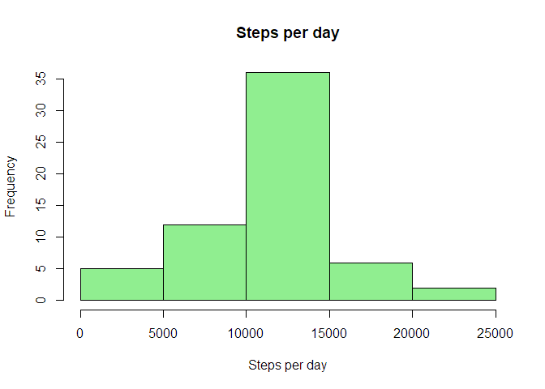

# Reproducible Research: Peer Assessment 1


## Loading data 

```r
dataFile <- "activity.zip"
dt.data <- read.csv(unzip(dataFile))
```

## Preprocessing data

```r
library(dplyr)
library(lubridate)
library(lattice)

dt.data <- dt.data %>% mutate(date = ymd(as.character(date)))

dt.stepsperday <- dt.data %>% 
  select(date, steps) %>%
  filter(!is.na(steps)) %>%
  group_by(date) %>%
  summarise(steps = sum(steps))
```

## What is mean total number of steps taken per day?

1. Make a histogram of the total number of steps taken each day


```r
hist(dt.stepsperday$steps,
     main = "Steps per day", 
     xlab= "Steps per day", 
     col="lightblue")
```

<!-- -->

2. Calculate and report the mean and median total number of steps taken per day  


```r
mean(dt.stepsperday$steps)
```

```
## [1] 10766.19
```

```r
median(dt.stepsperday$steps)
```

```
## [1] 10765
```

## What is the average daily activity pattern?

1. Make a time series plot (i.e. type = "l") of the 5-minute interval (x-axis)
and the average number of steps taken, averaged across all days (y-axis)


```r
dt.intervalavg <- dt.data %>%
  filter(!is.na(steps)) %>%
  group_by(interval) %>%
  summarise(steps = mean(steps))

with(dt.intervalavg,
     plot(interval, steps, type="l")
)
```

<!-- -->

2. Which 5-minute interval, on average across all the days in the dataset,
contains the maximum number of steps?


```r
max_step <- dt.intervalavg %>% 
  summarise(max_step = max(steps))

max_step <- max_step$max_step[1]

dt.intervalavg %>% filter(steps == max_step)
```

```
## # A tibble: 1 x 2
##   interval    steps
##      <int>    <dbl>
## 1      835 206.1698
```

## Imputing missing values

1. Calculate and report the total number of missing values in the dataset (i.e. the total number of rows with NAs)


```r
summary(dt.data)
```

```
##      steps             date               interval     
##  Min.   :  0.00   Min.   :2012-10-01   Min.   :   0.0  
##  1st Qu.:  0.00   1st Qu.:2012-10-16   1st Qu.: 588.8  
##  Median :  0.00   Median :2012-10-31   Median :1177.5  
##  Mean   : 37.38   Mean   :2012-10-31   Mean   :1177.5  
##  3rd Qu.: 12.00   3rd Qu.:2012-11-15   3rd Qu.:1766.2  
##  Max.   :806.00   Max.   :2012-11-30   Max.   :2355.0  
##  NA's   :2304
```

```r
dt.data %>% filter(is.na(steps)) %>% count()
```

```
## # A tibble: 1 x 1
##       n
##   <int>
## 1  2304
```

2. Devise a strategy for filling in all of the missing values in the dataset. Use the mean steps per day to fill the missing value.


```r
dt.fine_data <- dt.data %>% 
  inner_join(dt.intervalavg, by = "interval") %>%
  mutate( new_step = ifelse(is.na(steps.x), steps.y, steps.x),
          date = ymd(as.character(date))) %>%
  select (steps = new_step, date, interval )
```

3. Create a new dataset that is equal to the original dataset but with the missing data filled in.


```r
dt.stepsperday <- dt.fine_data %>%
  select(date, steps) %>%
  filter(!is.na(steps)) %>%
  group_by(date) %>%
  summarise(steps = sum(steps))
```

4. Make a histogram of the total number of steps taken each day and Calculate and report the mean and median total number of steps taken per day.


```r
hist(dt.stepsperday$steps, main = "Steps per day", xlab= "Steps per day", col="lightgreen")
```

<!-- -->

```r
mean(dt.stepsperday$steps)
```

```
## [1] 10766.19
```

```r
median(dt.stepsperday$steps)
```

```
## [1] 10766.19
```

*Since we used the mean total steps per day, we can observe that the histogram the frequency of the backet between 10000 and 15000 increased significantly*

## Are there differences in activity patterns between weekdays and weekends?

1. Create a new factor variable in the dataset with two levels - "weekday" and "weekend" indicating whether a given date is a weekday or weekend day.


```r
dt.fine_data <- dt.fine_data %>% mutate(wday = ifelse(wday(date) %in% c(1,7), "Weekend", "Weekday"))

dt.weekinterval <- dt.fine_data %>%
  group_by(wday, interval) %>%
  summarise(steps = mean(steps))
```

2. Make a panel plot containing a time series plot (i.e. type = "l") of the 5-minute interval (x-axis) and the average number of steps taken, averaged across all weekday days or weekend days (y-axis).


```r
xyplot(steps ~ interval | wday, data = dt.weekinterval
       , type = "l"
       , layout = c(1,2)
       , ylab = "Number of steps"
       , xlab = "Interval"
       )
```

<!-- -->
